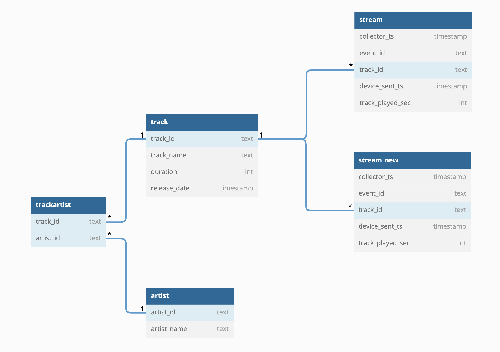

<p align="center">
    
</p>


# Mobile Stream Analysis

At Epidemic Sound we launched a mobile app where users can listen to our songs and create their playlists.
The Analytics Engineering team got the task to query the data and provide insights into what tracks and artists are played.
These queries will later be implemented in [dbt](https://docs.getdbt.com/docs/introduction) to create our new mobile analytics tables.

Your objective is to query the `epidemic` database ([epidemic.db](epidemic.db)) and analyze the listening behavior of our users in the mobile app.

## Data
The data and tables for this task are stored in the [epidemic.db](epidemic.db) SQLite database bundled within the repository.
The database contains the following tables:
- `stream`
- `stream_new`
- `track`
- `artist`
- `trackartist`

`stream` and `stream_new` mock events from our event tracking system, where events get a timestamp both on the client device sending the event and on the server receiving the event (the `collector_ts`); 
for this exercise, you can assume that the device timestamp is reliable and running in the same timezone as the server.
Other tables mock data coming from the backend database for the mobile app (e.g. a database dump). As is common for analytical databases, no constraints are enforced on the tables, this implies that the data can be duplicated within the tables.


See the database schema below how the tables relate to each other:



## Task
**The assignment should take an evening to complete.**

We'd like you to write queries to answer the following five questions.
Based on how the data looks, you may need to make assumptions; please list them and motivate them in the [README.md](/src/README.md) file, together with your design decisions. 

- We encourage you to write a query to populate a fact table called `fact_stream`, which you can refer to in subsequent queries. You might find that it makes tasks 1-5 easier. 
- We also encourage you to spend some time exploring the data beforehand, exploring things like time differences between the timestamps of the events, if fields that one would assume to be unique really are unique etc. 

**NOTE: You can disregard the `stream_new` table for this part.**

1) How many tracks do we have in our catalog?
2) Which song has been streamed for the most minutes, and how many people worked on it?
3) Who are the 3 most played artists, and how many plays do they have?
4) What were the titles of the top 3 most streamed songs during each year, and how many streams did they get?
5) How long do we need to expect to wait until we have received 99% of a given set of stream events at the collector relative to when the events were created?

Each query should be written in the corresponding file inside the [queries folder](/src/queries).
You are also free to use the provided functions in the Python scripts to explore the data.

We'd also like you to write a short answer to these five questions in the same [README.md](/src/README.md) file - no more than a few sentences for each, the answers will be used as discussion points in a following interview.

6) Would you have built any other tables on top of the provided data to aid your work?
7) `artist` and `track` contain PII data; how would you handle this kind of sensitive data while creating a data model on top of those tables?
8) `stream_new` represents new data that we would like to merge with the old stream data as it comes in; how would you design the fact table (`fact_stream`) to scale efficiently?
9) Your stakeholder wants to know the exact amount of plays per day, but as you saw the streams can arrive delayed in the database. How would you handle the delayed data?
10) To increase the robustness of our reporting layer we would like to have data quality tests in place. What tests would you propose and how would you implement them?

Is there any other question that you think would be interesting to answer? Feel free to add it to the list above!

## How to use this repo?

You can use the `fetch_data()` helper function in the [sql.py](/src/sql.py) file to query the database and explore the data. For example:
```python
data = fetch_data(
    """
    SELECT track_name
    FROM track
    """
)
```
The [main.py](src/main.py) script will run all queries in the [queries folder](/src/queries). We will use the original version of the main.py script for the evaluation; you are of course free to modify it or add other Python files while working on your submission.

## Deliverable
Create a new branch in this repo and commit your queries and the [README.md](/src/README.md) documenting your work. Then zip the repository and re-upload it back to the Google Drive folder. Don't forget to format your source code before submitting it.

We will check out your [queries folder](/src/queries) and run the [main.py](src/main.py) script against the provided database.

After a review, you may be invited to present your solution to the Analytics Engineering team. There is no need to prepare presentation slides, your committed code and the [README.md](/src/README.md) will be sufficient.

Don't worry if you do not manage to answer all questions; we are going to evaluate the submission as a whole.

# Appendix

## FAQ
If you have any questions about the assignment, email us at **analytics-engineering@epidemicsound.com** - asking questions is a good thing!

### Tech stack

`BigQuery`, `sql`, `dbt` and, `Python` are important tools in our everyday work. We focused on plain SQL for the assignment for simplicity; if you choose to use Python to work on the assignment, you're welcome to submit additional Python files.
